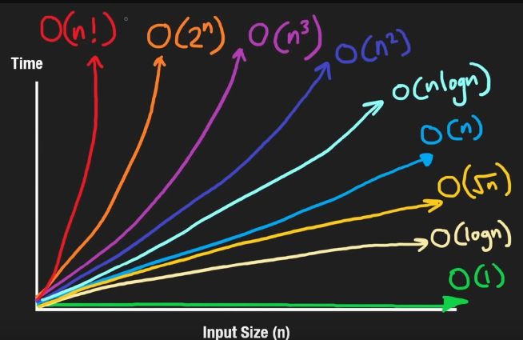
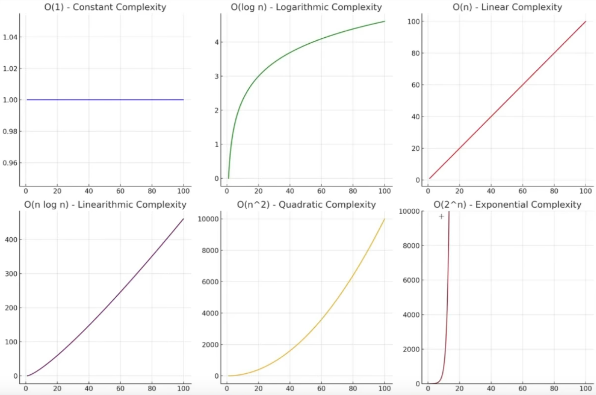

# big O
forma de analisar/mensurar runtime de um código baseado em seu input

se aumenta o input, aumenta o tempo de execução
(sempre o pior cenario possível)

ordenação dos melhores aos poiores (das principais):
```
O(1) - constante
O(log n) - logaritimo (contrario de quadrado)
O(n) - linear (busca linear, for normal)
O(n log n) - log linear
--- daqui pra baixo evita dog \/
O(n ^ 2) - quadratico
O(2 ^ n) - exponencial
```

evitar os n^2, 2^n
a não ser que tenha um volume de dados pequeno e pre definido


explicações a partir dos graficos abaixo

obs:
não é tão importante vc saber precisamente qual a complexidade do seu código
o importante é ter um overview de como essas complexidades funcionam e estão relacionadas
sempre tentando ir pro lado direito do grafico


## O(n!) - n factorial
são mt raros, se vc está usando algum n fatorial vc provavelmente ta fazendo merda, tirando alguns casos especificos
eles crescem de forma fatorial, exemplo:
5! = 5*4*3*2*1
diferente de 2^N
que seria: 2^5 = 2*2*2*2*2

permutations and travelling salesman problem

## O(2^N)
toda vez q seu volume de dados aumenta, teu runtime dobra
recurssão é um exemplo
```js
function fibonacci(num) {
	if(num <= 1) return 1;
	
	return fibonacci(num - 2) + fibonacci(num - 1);
}
```
*bigo_meme_o2n*

```js
function todasCombinacoes(lista) {
	if(lista.length == 0) {
		return [[]];
	}
	let subconjunto = combinacoes(lista.slice(0,-1));
	let extra = lista.slice(-1);
	let novo = [];
	for(sublista of subconjunto) {
		novo.push([...sublista, ...extra]);
	}
	return [...subconjunto, ...novo];
}

const listCheck = [1,3,5,7,9];
console.log("combinações (powerset): ", todasCombinacoes(listCheck) );

todasCombinacoes(lista = [1,3,5,7]);

// [1,3,5,7]
// [1,3,5]
// [1,3]
// [1]
// []
```

## O(N^3)
o maior o^n q vc provavelmente vai ver, é possível fazer 4,5,6, mas é bem incomum e se vc consegue identificar 2,3, vc consegue identificar os outros
```js
nums = [1, 2, 3]
for i in range(len(nums)):
    for j in range(i + 1, len(nums)):
        for k in range(j + 1, len(nums)):
            print(nums[i], nums[j], nums[k])
```

## O(N^2) - ao quadrado (se tivesse 3 seria ao cubo)
loop dentro de loop
```js
function pair(arr) {
	for(let a of arr) {
		for(let b of arr) {
			console.log(a,b);
		}
	}
}

console.log(pair[1,2,3,4]);
```
- não necessariamente todos os loops dentro de loops são o(n^2)

## O(n log n)
sortings como merge sort por exemplo

percorre todos os itens da lista 1 vez [o(n)]
e percorre a lista de forma logaritima 1 vez [o(log n)]
então (n log n)


## O(n) - crescimento linear

percorrer um array dado um input
valor pode ir de 1 a N dependendo do valor passado
```js
function find(arr, elem) {
	let found;
	
	for(let e of arr) {
		if(e == elem) {
			found = e;
		}
	}
	
	return found;
}

console.log([1,2,3], 4);
```

obs:
loop dps loop é o(n), não é o(n^2) só é o(n^2) se for loop dentro de loop
```js
// msm coisa 1
function Pergunta(arr, minhaMarcacao, suaMarcacao) {
	let meu, seu;
	for(let i = 0; i < arr.lenght; i++) {
		if(arr[i] == minhaMarcacao) {
			meu = minhaMarcacao;
			break;
		}
		if(arr[i] == suaMarcacao) {
			seu = suaMarcacao;
			break;
		}
	}

}
// msm coisa 2
function Pergunta(arr, arr2, minhaMarcacao, suaMarcacao) {
	let meu, seu;
	for(let i = 0; i < arr.lenght; i++) {
		if(arr[i] == minhaMarcacao) {
			meu = minhaMarcacao;
			break;
		}
	}
	for(let i = 0; i < arr.lenght; i++) {
		if(arr[i] == suaMarcacao) {
			seu = suaMarcacao;
			break;
		}
	}
}
```

## O(log n)
valores de inputs que vão dividindo por dois até chegar em um resultado, como por exemplo
achar um valor em uma pesquisa em uma arvore binaria balanceada, pq vai divindo por dois e matando metade (indo pra direita ou esquerda)
a diferença de (log n) pra (n) é gigante se o valor do input for muito grande

## O(1)
direto no valor
como acessar um valor num array
n importa qnts tenham o tempo de acesso final vai ser sempre o msm
ex1:
```js
function first(arr) {
	return arr[0];
}
```
ex2:
```js
const arr = [1,2,3];
const a = arr[0];
```

outros exemplos seriam hash map / set

# vale a pena reordenar uma lista pra melhorar a eficiencia?

depende, se for abaixar na ordem citada acima vale

```
O(1) - constante
O(log n) - logaritimo (contrario de quadrado)
O(n) - linear (busca linear, for normal)
O(n log n) - log linear
--- daqui pra baixo evita dog \/
O(n ^ 2) - quadratico
O(2 ^ n) - exponencial
```

## nao vale
ordenar uma lista em um O(n) que vai virar O(n log n), n faz sentido pq cresceu a complexidade
- obs: sem falar em cache...

## vale
agora no caso de uma O(n ^ 2) ordenada, já vale


## img
veja com numeros:
