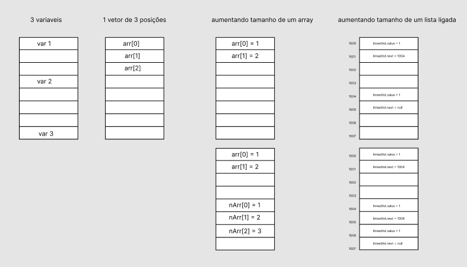

todo:
- implementações das principais estrutura de dados, explicando a vantagem e desvantagem de usar ela (big O)
- revisitar todas as implementações e praticar (tree falta alguns metodos, graphs tbm, não quis perder tanto tempo com essas estruturas)

# estrutura de dados

formas de organizar dados na memoria do computador
cada uma com sua vantagem ou desvantagem de uso, dependendo do uso desses dados (percorrer, adicionar, remover, organizar)[no meio, no final]
, muitas vezes não é só como armazenamentos esses dados, é muito mais sobre as operações que queremos fazer com esses dados

## examplos

### array example
imagina criar varias variaveis na memoria do computador, pra acessar elas, elas estariam todas expalhadas

pra isso criariamos um array

### linked list example
imagina que esse array precise ficar mudando de tamanho sempre, toda vez que vc aumenta ou diminui um array, vc tem que criar outra alocação e reconstruir o array

seria muito melhor usar uma lista ligada pra isso, que tem o valor e o caminho pro proximo valor

### priority queue example (sem img)
se vc quer criar uma lista de itens que precisam ser adicionados e removidos com prioridade, vc irá criar uma fila de prioridade, simplesmente porque é mais efetivo

## outras/implementações (pastas)
existem diversas outras, eu vou explicar as principais na pasta de estrutura de dados e o pq usar, esses exemplos acima foi só pra introduzir e explicar o pq usar

## por que uma estrutura de dados é melhor do que a outra?
dependendo da estrutura de dados:
tem estrutura de dados que são mais efetivas de percorrer do que adicionar, outras o contrario...

# por que precisamos aprender isso? pq as empresas pedem isso?
as empresas pedem conhecimento nessa área porque
por mais que você consiga codar alguma solução sem escolher a estrutura de dados correta, você provavelmente não vai estar fazendo isso da maneira mais efeiciente
e quando se trata de manipular dados em empresas grandes isso se torna cada vez mais importante, porque eles lidam com milhões de dados

# implementações

- explicar cada uma das principais estruturas de dados (vantagens e desvantagens)
- colocar os N de N

## arrays
- [Arrays](../js/js_array.md)
- [Javascript Arrays](../js/js_array.md)

## pilhas
- [Pilhas/Stacks (FIFO - First in, first out)](./datastruct_implements/pilha.js)
## filas
- [Filas/Queue (LIFO - Last in, last out)](./datastruct_implements/fila.js)
- [Fila com prioridade](./datastruct_implements/filaPrioridade.js)

# listas
- [Lista Ligada/Encadeada - Linked List](./datastruct_implements/linkedList.js)
- [2 Lista Ligada/Encadeada - Linked List](./datastruct_implements/linkedList2.js)

# conjuntos (set)
- [1 Conjuntos/Set](./datastruct_implements/set.js)
- [2 Conjuntos/Set](./datastruct_implements/set2_our.js)
- [3 Conjuntos/Set](./datastruct_implements/set3_example_futebol.js)

# dicionarios e hashes (map)
- [Map](./datastruct_implements/map.js)
- [Map](./datastruct_implements/map2_our.js)
- [não implementei dicionario de hash ainda](./datastruct_implements/map3_ehashtable.js)

# arvores [file system SO] (dps de completar, fazer o heap sort dos algoritimos de busca)
- [Arvore](./datastruct_implements/tree.js)
- [Arvore](./datastruct_implements/tree2.js)

# grafos [relacionamentos redes sociais, calcular distancias entre duas localidades google maps]
- [Grafos](./datastruct_implements/graphs.js)

