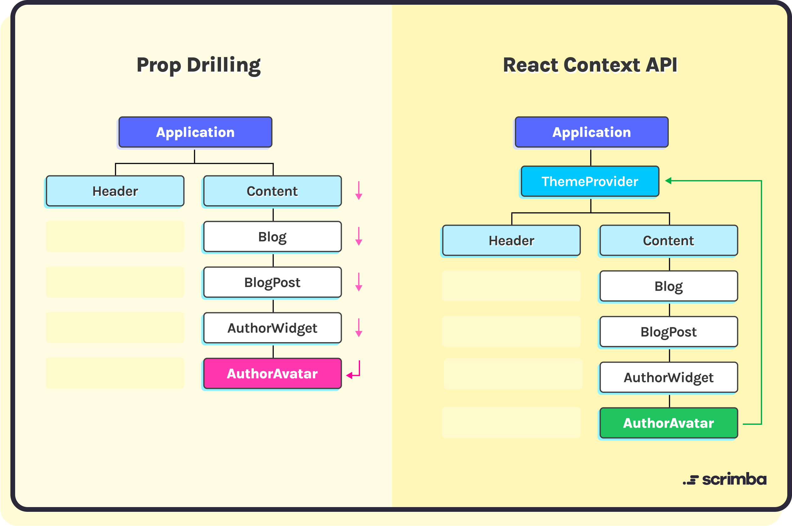

# React

<!--
basico do react

oq é, pq existe (LIB, VIRTUAL DOM)

conceitos basicos:
- componentente (JSX, props) {
- states
= context (contextos maiores)
ciclo de vida (useEffect: montar, alterar, desmontar)
-->


## o que é react?
Opensource LIB de componentes JS criada pelo Facebook para criar UI (interfaces) web complexas e interativas.

O React controi toda a página com uma SPA (single page application), toda em JavaScript podendo assim fazer alterações pontuais quando houver alterações na virtual DOM.


## virtual Dom vs DOM

- virtual dom = uma representação em memoria do real dom
- real dom = arvore real de elementos da pagina


O React fica de olho nas mudanças do virtual dom, pra alterar a DOM só onde é necessário, sem precisar re-renderizar tudo de novo
(sem ter que reconstruir a dom inteira, só reconstruindo a parte interativa da virutal dom)

tendo assim ganho em DESEMPENHO e USABILIDADE pq:
qnd ocorrem atualizações, o virtual
compara o estado anterior e o atual
identifica as diferenças
e atualiza apenas a parte que precisa ser alterada
ao inves de refazer tudo


# criando um componente
componente é um modelo pra reaproveitamento de código
transformando tags HTML em códigos reutilizaveis (JSX)

tecnicamente falando: um componente é uma função que retorna um JSX

## JSX (JavaScript XML)
é como criar sua propria tag HTML e poder reutilizar ela em varios lugares
por exemplo:
```tsx
export default function PinkButton({ size, onPress }: { size: number; onPress: Function ) {
	return (
		<button style={{ backgroundColor: pink,  width: size onPress={() => onPress()} />
	);
}
```
podendo assim usar em varios lugares:
```tsx
<PinkButton size={100} onPress={() => alert("clicou 1")} />
<PinkButton size={150} onPress={() => alert("clicou 2")} />
```

# props
atributos/metodos que é passada pra um componente da mesma forma que um argumento é passado pra uma função

## exemplo de criação de componente com props:
```js
function Text(props) {
	return (<span style={{ fontSize: props.size }}>{props.title}</span>
}
```

normalmente mais utilizado com desetruturação de objetos pra ficar mais legivel
```tsx
function Text({ size, title }) {
	return (<span style={{ fontSize: size }}>{title}</span>
}
```

## exemplo do uso desse componente:
```tsx
<Text size={20} title="Teste do componente texto" />
```


# state
variavel que pode mudar durante o ciclo de vida de um componente
que pode ser re-renderizada na tela com alguma interação do usuário ou evento
ela muda na tela sem precisar recarregar a página toda

```jsx
function ComponenteExemplo() {
  const [counter, setCounter] = useState(0);
  return (
    <div>
      <span>Quantas vezes o botão foi clicado: {counter}</span>
      <button
        onClick={() => {
          setCounter(counter+1)
        }}
      >
        Aumentar Contador
      </button>
    </div>
  )
}
```


# refs
as vezes acessar a dom é necessário
useRef pode te levar a um componente/atributo sem precisar ficar passando props pra baixo desnecessariamente

exemplo, um botão que da focus em um input logo em cima dele (a referencia pro input e pegada pelo useRef)
```tsx
import React, { useRef } from 'react';

function InputFocusComponent() {
  const inputRef = useRef(null);

  const focusInput = () => {
    inputRef.current.focus();
  };

  return (
    <div>
      <input ref={inputRef} type="text" />
      <button onClick={focusInput}>Focus no Input</button>
    </div>
  );
}

export default InputFocusComponent;
```

# contexto

Pra transportar um state entre componentes pais e filhos, você precisa passar por props, o que pode acabar gerando um problema que é o Props Drilling.

Que é você ter que passar uma props várias vezes, só pra poder acessar num componente Tataraneto




Se eu quiser pegar esse UserId em `AuthorAvatar`
por props eu teria que passar de um a um até chegar lá
com o context API você consegue gerar um contexto maior, acessar e alterar ele sem ter que fazer esse malabarismo todo


forma de transportar data sem precisar passar props de pai pra filho
com context api vc pode gerar um state global, acessar e alterar ele sem precisar

você cria um Provider com os "states globais", abaixo desse provider coloca todos os filhos e todos os filhos terão acesso a esses states globais:
```tsx
import React, { createContext, useContext, useState } from 'react';

// Criando um contexto para o tema
const ThemeContext = createContext();

// Componente pai que fornece o contexto
function App() {
  const [theme, setTheme] = useState('light');

  return (
    <ThemeContext.Provider value={{ theme, setTheme }}>
      <div>
        <Header />
        <Content />
        <Footer />
      </div>
    </ThemeContext.Provider>
  );
}

// Componente filho que consome o contexto
function Header() {
  const { theme, setTheme } = useContext(ThemeContext);

  return (
    <header style={{ background: theme === 'light' ? '#eee' : '#333', color: theme === 'light' ? '#333' : '#eee' }}>
      <h1>Header</h1>
      <button onClick={() => setTheme(theme === 'light' ? 'dark' : 'light')}>
        Toggle Theme
      </button>
    </header>
  );
}

// Outros componentes filhos
function Content() {
  return (
    <div>
      <h2>Content</h2>
      <p>Conteúdo da aplicação...</p>
    </div>
  );
}

function Footer() {
  return (
    <footer>
      <h3>Footer</h3>
      <p>Rodapé da aplicação...</p>
    </footer>
  );
}

export default App;
```


# conditional render
é normal renderizar um componente atraves de uma condição
usando falsie do JS vc pode fazer renderizações condicionais como:

```tsx
<>
isMobile && <MobileComponent />
</>
```

validando com &&, || ou até mesmo ternarios:
```tsx
<>
isMobile ? <MobileComponent /> : <ComputerComponent />
</>
```

# ciclo de vida de um componente react
cada React component tem seu proprio ciclo de vida
cada estagio do ciclo de vida invoca uma serie de metodos fazendo com que nós possamos interagir em cada um desses momentos
entender os difernetes ciclos de vida de um componente faz com que a gente possa usar eles de forma eficiente

o `UseEffect` é o hook para lidar com os ciclos de vida de um componente funcional no React
hook react para efeitos colateriais em um componente funcional (como lidar com ciclo de vida, alteração de um estado, ao montar o componente)
serve pra lidar com tarefas após a renderização (ex: req api)

## Mounting: O componente é inicializado e inserido no DOM.
useEffect com array vazio
```tsx
import React, { useEffect } from 'react';

function MyComponent() {
  useEffect(() => {
    // Código executado após o componente ser montado
    console.log('Componente montado');
  }, []); // Lista de dependências vazia indica que o efeito deve ser executado apenas uma vez

  return <div>Meu Componente</div>;
}

export default MyComponent;
```

## Updating: O componente é atualizado quando ocorrem mudanças em suas props ou estado.
useEffect com array preenchido com variaveis que o React ficará de olho pra ao alterar chamar
```tsx
import React, { useState, useEffect } from 'react';

function MyComponent() {
  const [count, setCount] = useState(0);

  useEffect(() => {
    // Código executado sempre que 'count' for atualizado
    console.log('O valor de count mudou:', count);
  }, [count]); // 'count' é a dependência

  return (
    <div>
      <p>Count: {count}</p>
      <button onClick={() => setCount(count + 1)}>Incrementar</button>
    </div>
  );
}

export default MyComponent;
```

## Unmounting: O componente é removido do DOM.
useEffect com array vazio, mas o desmonte é dentro do return
```tsx
import React, { useEffect } from 'react';

function MyComponent() {
  useEffect(() => {
    console.log('Componente montado');

    return () => {
      console.log('Componente desmontado');
    };
  }, []);

  return <div>Meu Componente</div>;
}

export default MyComponent;
```
OBS: esse é meio raro de ser usado, eu mesmo não me lembro de ter usado, mas pode ser usado pra por exemplo desfazer uma lista quando o usuário trocar de página por exemplo


# como rodar loops em componentes react (no JSX)
for normal, for in, for of não funcionam em componentes react (dentro do JSX, se quiser usar eles só fora), só array.forEach ou array.map

exemplo de uso:
```tsx
import React from 'react';

function MyComponent() {
  const items = ['item1', 'item2', 'item3'];

  return (
    <div>
      {items.map((item) => (
        <div key={item}>{item}</div>
      ))}
    </div>
  );
}

export default MyComponent;
```

# useMemo
memorizar valores computacionalmente pesados
- Calculos computacionalmente pesados
- Criação de objetos ou arrays computacionalmente caros
- Transformação de dados computacionalmente caros
- Criação de Funções computacionalmente caros
pra não precisar ficar fazendo rerender

exemplo de `Transformação de dados computacionalmente caros`
```tsx
import React, { useState, useMemo } from 'react';

function DataTransformationComponent({ data }) {
  const [filter, setFilter] = useState('');

  // Utilizando o useMemo para memoizar a transformação dos dados baseado no filtro
  const filteredData = useMemo(() => {
    // Simulando uma transformação de dados (por exemplo, filtrando por uma determinada propriedade)
    return data.filter(item => item.name.toLowerCase().includes(filter.toLowerCase()));
  }, [data, filter]); // Dependências do useMemo: 'data' e 'filter'

  return (
    <div>
      <input 
        type="text" 
        value={filter} 
        onChange={e => setFilter(e.target.value)} 
        placeholder="Filtrar por nome" 
      />
      <ul>
        {filteredData.map(item => (
          <li key={item.id}>{item.name}</li>
        ))}
      </ul>
    </div>
  );
}

export default DataTransformationComponent;
```
é como um useEffect, ao alterar
[data, filter]
ele vai recalcular, mas o useEffect é feito pra manipulações na DOM e pode gerar comportamentos inapropriados
o useMemo salva em cache, e é mais semantico


# ==============================================
# ADVANCED, mas o pai sabe
# ==============================================
# What are React Fragments used for?
```tsx
// Usando um fragment
return (
  <>
    <Componente1 />
    <Componente2 />
  </>
);

// Usando uma div
return (
  <div>
    <Componente1 />
    <Componente2 />
  </div>
);
```
Ambos os exemplos produzirão o mesmo resultado visual, mas o uso do fragment evitará adicionar uma div extra à árvore DOM. Isso pode ser útil em situações onde você deseja manter uma estrutura DOM mais limpa e semântica.

# O que você faria se sua aplicação estivesse pesada
# How to prevent re-renders in React?
- Evitar a passagem de props desnecessárias: Evite passar props desnecessárias para componentes filhos. Se uma prop não é utilizada pelo componente filho ou não afeta a saída renderizada, evite passá-la.

- Divisão de componentes: Divida seus componentes em unidades menores e mais granulares, o que pode reduzir o número de re-renders, pois apenas os componentes relevantes serão atualizados quando suas props ou estado mudarem.
(que até é uma boa pratica de programação, S do solid, uma componente é uma função, o ideal é que uma função tenha apenas uma responsabilidade)

- Evitar setState inutil, nunca usar setState pra um mesmo state, por exemplo, se value é 1 e vc user setValue(1) ele vai chamar rerender de tudo que tenha value

- Utilizar React.memo (para componentes funcionais): Use o React.memo para criar componentes funcionais memoizados que só serão re-renderizados se suas props mudarem.

# Como seria uma boa forma de modularizar codigos em projetos React?
Divisão por responsabilidade por componente (SINGLE RESPONSABILITY)
Context API para contextos globais (pra não ficar passando um monte de props)
Padrões de nomenclatura consistentes (componentes são funções, bons códigos tem funções, váriaveis, componentes... bem nomeados pra ao passar o olho entender o que o componente faz)
Hooks personalizados

# por que key={index} em maps são ruins
Usar key={index} em mapeamentos é ruim porque, se a ordem da lista mudar, o React recriará toda a lista (chamando o rerender pra todos).
Ao usar algo como user.uid, as mudanças na ordem não resultarão na recriação completa da lista (chamando o rerender só pros que realmente mudar).


# ==============================================
# ADVANCED, se pa nem deveria saber (muitos eu nao sei mesmo)
# ==============================================

# Flux (conceito que o Redux usava lá da globo)

Flux é uma arquitetura de gerenciamento de estado unidirecional, onde o fluxo de dados em sua aplicação tem uma única direção.
Isso significa que os dados fluem de um ponto central (o store) para os componentes da interface do usuário, e as ações dos usuários desencadeiam atualizações de estado que são propagadas de volta para o store.

- Actions
- Store
- Dispatcher
- Views (ou Components)
Este é um exemplo básico que ilustra como os conceitos do Flux podem ser aplicados em um aplicativo React para gerenciar o estado de forma unidirecional e previsível.

## Actions: São objetos que descrevem uma intenção de mudança de estado. Geralmente, são gerados por eventos do usuário ou respostas de APIs.
```javascript
const incrementCounter = () => ({
  type: 'INCREMENT_COUNTER'
});
```

## Store: Mantém o estado da aplicação e gerencia a lógica de negócios. Ele responde a ações e emite eventos para notificar as visualizações sobre as alterações no estado.
```javascript
const counterStore = {
  state: {
    count: 0
  },
  handleAction(action) {
    if (action.type === 'INCREMENT_COUNTER') {
      this.state.count++;
      // Emitir evento para notificar as visualizações
      CounterStore.emitChange();
    }
  },
  // Métodos para registrar e desregistrar listeners
  // e emitir eventos de alteração
};
```

## Dispatcher: Recebe ações e as encaminha para os stores correspondentes. Ele garante que as ações sejam processadas em uma ordem previsível.
```javascript
const dispatcher = {
  dispatch(action) {
    // Lógica para encaminhar a ação para os stores
  }
};
```

## Views (ou Components): São as partes da interface do usuário que exibem o estado da aplicação. Elas se inscrevem nos stores relevantes e atualizam a interface quando o estado muda.
```jsx
Copy code
import React, { useState, useEffect } from 'react';
import counterStore from './counterStore';

function CounterComponent() {
  const [count, setCount] = useState(counterStore.state.count);

  useEffect(() => {
    const handleChange = () => {
      setCount(counterStore.state.count);
    };
    counterStore.addChangeListener(handleChange);
    return () => {
      counterStore.removeChangeListener(handleChange);
    };
  }, []);

  const increment = () => {
    dispatcher.dispatch(incrementCounter());
  };

  return (
    <div>
      <p>Count: {count}</p>
      <button onClick={increment}>Increment</button>
    </div>
  );
}
```


# What are portals in React?
nunca usei:
tecnica pra renderizar um componente em qualquer parte da DOM

# O que é React Profiler e pra que ele é usados?
Ferramenta pra uso de CPU, igual o Profiler do samp, nunca usei
mas é usado principalmente pra:
- Identificação de gargalos de desempenho
- Análise do tempo de renderização
- Visualização da árvore de componentes
- Identificação de re-renderizações desnecessárias

# 4. What is StrictMode in React?
# CHAT GPT
StrictMode é um componente especial fornecido pelo React que ajuda a destacar potenciais problemas e práticas desencorajadas em sua aplicação. Ele não renderiza nenhum conteúdo visual por si só, mas quando é utilizado, ativa verificações adicionais e warnings para os componentes filhos.

Aqui estão algumas das verificações e avisos extras que o StrictMode ativa:

Identificação de efeitos colaterais inesperados: Detecta efeitos colaterais indesejados durante a renderização, como operações de escrita no DOM realizadas dentro de funções de renderização.

Avisos de uso obsoleto e desencorajado: Alerta sobre o uso de APIs obsoletas ou desencorajadas do React que podem ser removidas em versões futuras.

Identificação de práticas desencorajadas: Ajuda a identificar práticas que podem levar a problemas de desempenho ou dificuldades de manutenção, como a definição de múltiplos contextos ou a definição de props de componentes como mutáveis.

Detectar problemas de legado: Identifica uso de APIs ou padrões que são considerados problemáticos em versões anteriores do React.

O StrictMode é especialmente útil durante o desenvolvimento, pois ajuda a identificar problemas comuns e práticas desencorajadas antes que se tornem problemas maiores em produção. No entanto, é importante observar que o StrictMode apenas ativa avisos e verificações durante o desenvolvimento e não tem impacto no comportamento de produção da aplicação.


# lazyloading
O lazy loading é uma técnica utilizada para carregar recursos assincronamente:
```tsx
import React, { Suspense } from 'react';

const LazyComponent = React.lazy(() => import('./LazyComponent'));

function App() {
  return (
    <div>
      <h1>Minha aplicação</h1>
      <Suspense fallback={<div>Carregando...</div>}>
        <LazyComponent />
      </Suspense>
    </div>
  );
}

export default App;
```
Nesse exemplo vai renderizar a base do site e depois que a parte assincrona de LazyComponent for terminada vai renderizar o LazyComponent

Essa abordagem é semelhante ao que o YouTube e muitos outros sites fazem: eles carregam primeiro a estrutura básica da página, como a barra de navegação e outros elementos estáticos, e em seguida, carregam o conteúdo dinâmico, como vídeos, somente quando necessário. Isso ajuda a melhorar o desempenho percebido pelo usuário, permitindo uma renderização inicial mais rápida e carregamento assíncrono do conteúdo adicional.

# Higher-order components (HOCs)

Higher-order components (HOCs) são funções no React que recebem um componente como entrada e retornam outro componente. 

Os HOCs são comumente usados para abstrair comportamentos compartilhados entre componentes, como manipulação de estado, gerenciamento de autenticação, manipulação de propriedades, etc

exemplo:
```tsx
import React, { useState } from 'react';

// Um HOC que adiciona um contador de cliques a um componente
function withClickCounter(WrappedComponent) {
  return function WithClickCounter(props) {
    const [clickCount, setClickCount] = useState(0);

    function handleClick() {
      setClickCount(prevCount => prevCount + 1);
    }

    return (
      <WrappedComponent
        clickCount={clickCount}
        onClick={handleClick}
        {...props} // Passa todas as outras props para o componente envolvido
      />
    );
  };
}

// Um componente funcional simples que exibe o número de cliques
function ClickCounter({ clickCount, onClick }) {
  return (
    <div>
      <p>Número de cliques: {clickCount}</p>
      <button onClick={onClick}>Clique Aqui</button>
    </div>
  );
}

// Usando o HOC para criar um novo componente
const ClickCounterWithCounter = withClickCounter(ClickCounter);

// Usando o componente envolvido
function App() {
  return (
    <div>
      <h1>Componente com Contador de Cliques</h1>
      <ClickCounterWithCounter />
    </div>
  );
}

export default App;
```

# hooks personalizados

```tsx
import { useState } from 'react';

// Definição do hook personalizado
function useContador(initialCount = 0) {
  const [count, setCount] = useState(initialCount);

  const increment = () => {
    setCount(count + 1);
  };

  const decrement = () => {
    setCount(count - 1);
  };

  return { count, increment, decrement };
}

// Exemplo de uso do hook personalizado em um componente
function ContadorComponent() {
  const { count, increment, decrement } = useContador(0);

  return (
    <div>
      <p>Contagem: {count}</p>
      <button onClick={increment}>Incrementar</button>
      <button onClick={decrement}>Decrementar</button>
    </div>
  );
}
```

Para compartilhar lógica complexa entre componentes funcionais.
Para evitar a repetição de código em vários componentes.
Quando você precisa de uma maneira limpa e reutilizável de gerenciar o estado, efeitos colaterais ou outras funcionalidades em seus componentes.
