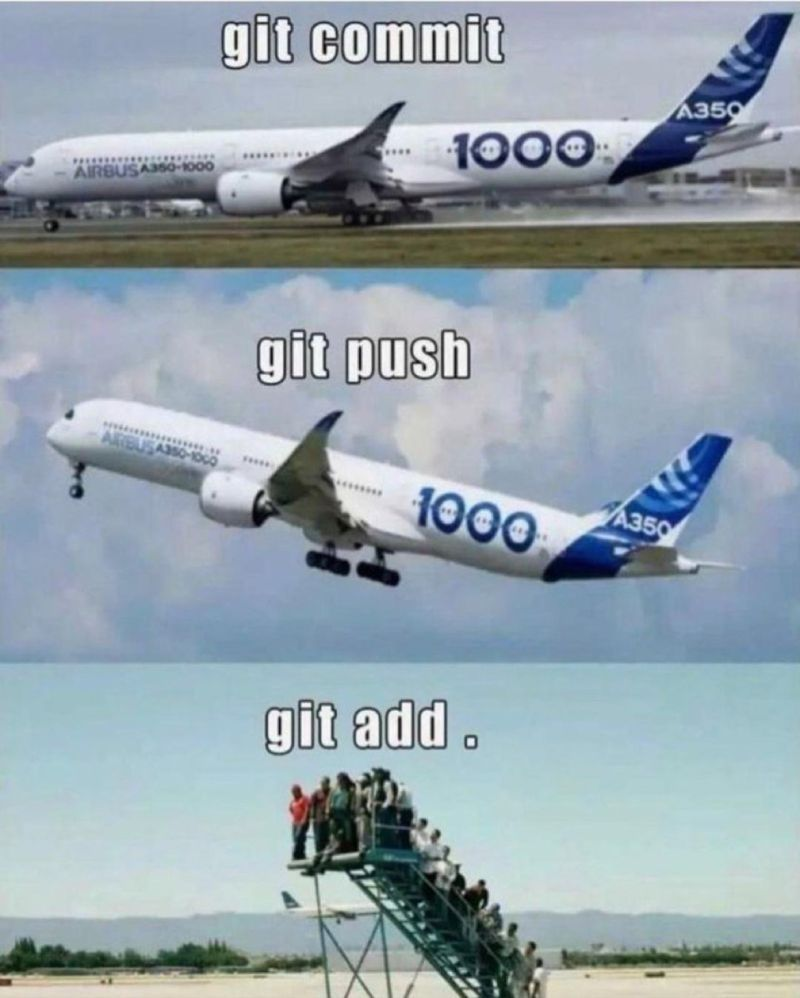

# intro
todo: analogia com linhas do tempo e git (historico, backup, controle de versão, trabalhar em grupo)

# ==========================
# basico: add, commit push
# ==========================

## git add
adicionar arquivos modificados para o commit

## git commit -m "o que mudou"
nomear o commit

pra commitar em 2 linhas use `git commit` sem -m, vai abrir um editor de texto no terminal, vc edita o commit salva e pronto ;)
bons commits tem 2 linhas (primeira = titulo, segunda/terceira = descrição)

## git push
o `git commit` vai salvar o historico no seu computador (na pasta `.git` invisivel)
você precisa enviar e sincronizar esses arquivos pra branch na web
enviar commit para o repositorio web

# ==========================
# branch
# ==========================

branch são como se fosse pastas de trabalho
quando você cria um repositorio ele vem com `master/main`, mas tem várias formas de trabalhar com branch
inclusive várias pessoas trabalhando num projeto só, cada um na sua branch e depois juntam elas

## merge e rebase
quando você precisa juntar uma branch vc precisa escolher entre um dos dois

*explicar diferença*
trabalhar em uma branch com micro commits
rebase

e merge na branch principal

## code review

### mostrar como funciona

### Como não ser um otário no code review.

Ao olhar o código pense o seguinte:
esse código faz oq foi definido de forma simples?

e não:
Eu faria desse jeito?

# GITFLOW

## voltar no tempo

## git stash

