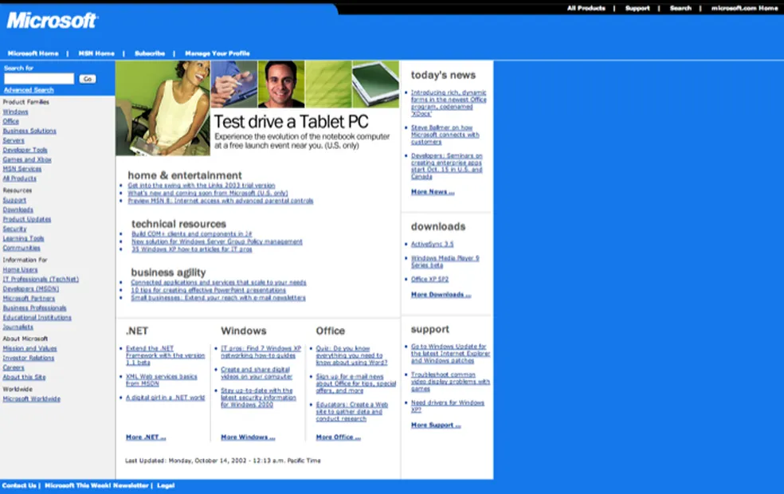
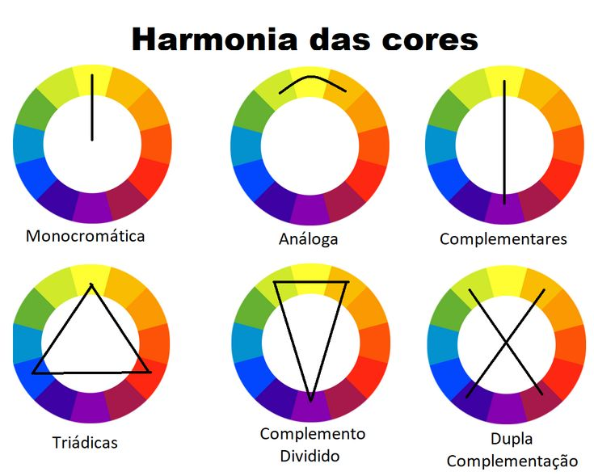
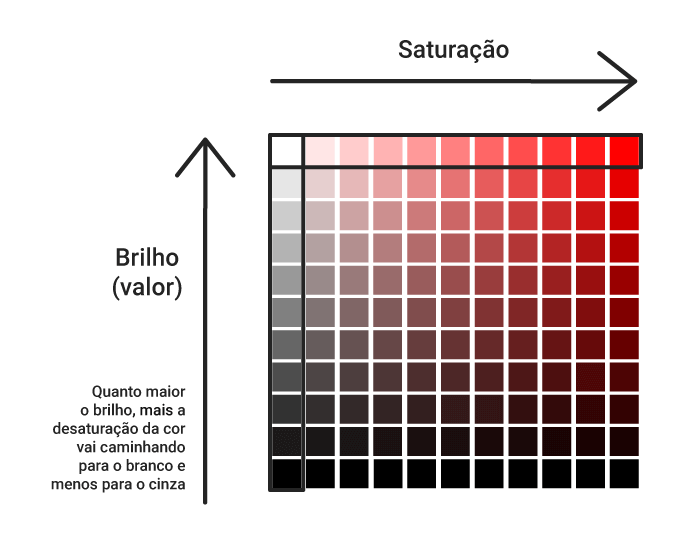
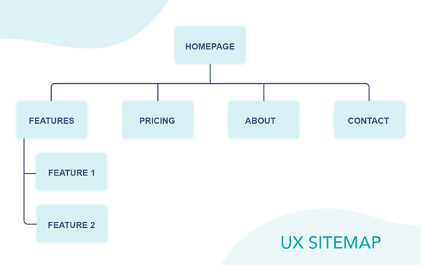
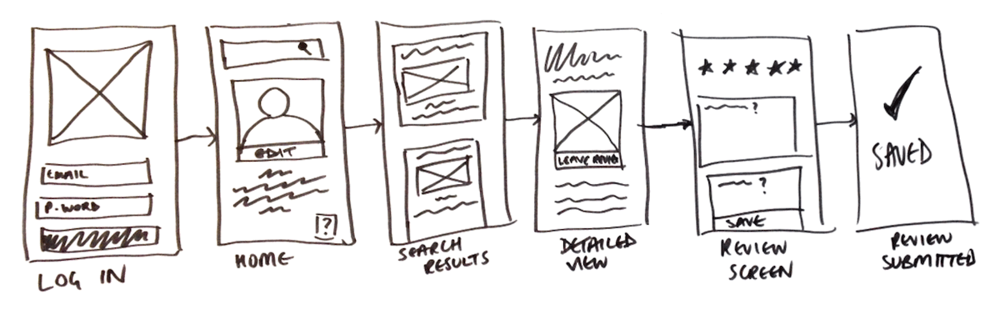
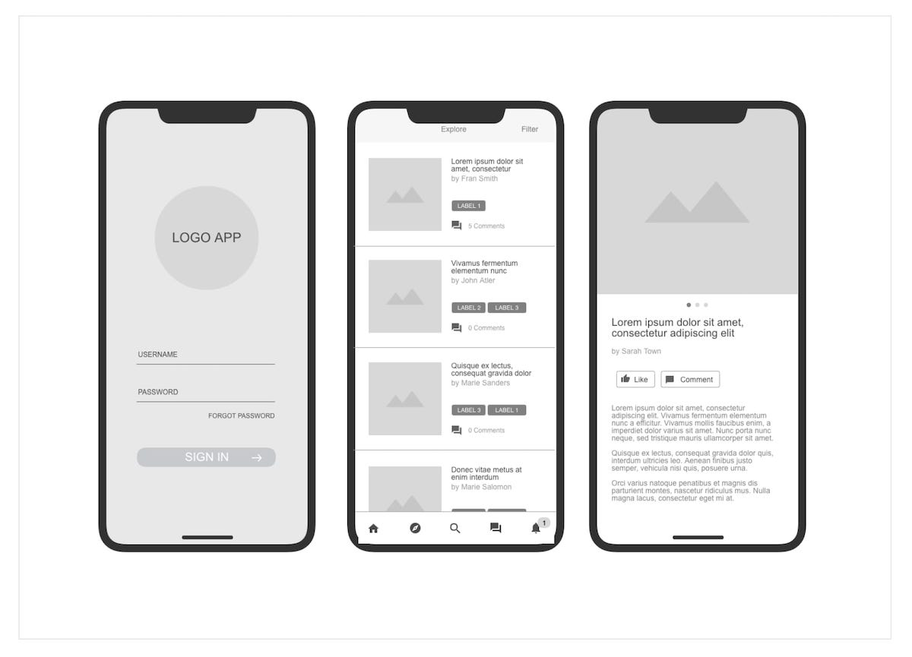
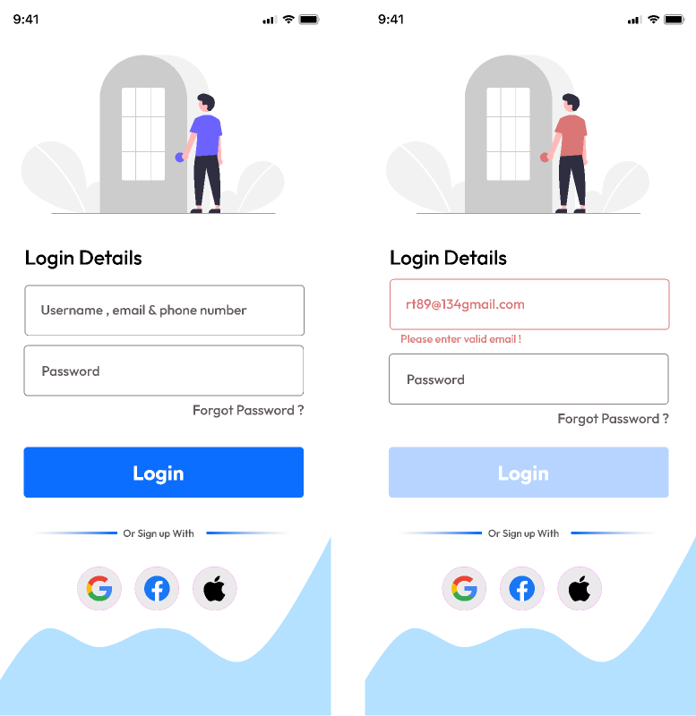

# intro a experiencia do usuario
a vida é experiencia do usuario, você experimenta, interpreta e renderiza o mundo ao seu redor na sua cabeça
- cores são como o seu cérebro processa diferentes comprimentos de onda de luz visível
- você não está vendo seu nariz agora porque seu cerebro filtra/apaga ele da sua frente

essas duas frases justificam o porque simetria/proporção é importante
e porque cores são importantes e porque algumas combinam e outras não

a sua experiencia dentro de uma interface pode ser dificultada ou facilitada

# conceitos de design

antes de falar de UX/UI precisamos ter alguns conceitos basicos de design que são
necessarios para fazer o design de forma coerente de forma consciente
todos os principios devem estar em comunhão

## alinhamento
nada é colacado na página a troco de nada
cada elemento tem um motivo pra estar ali

## contraste/proximidade
constrates:
evitar elementos meramentes similaries em uma pagina
serve pra diferenciar elementos que não tenha a mesma função

proximidade:
segue a regra contraria ao do contraste, itens similares devem ser agrupados
e diferentes separados

grupos:
objetos semelhantes em forma/cor/tamanho fazem parte de um grupo no nosso cerebro
objetos são figuras distintas que se destacam de um fundo
(exemplo: uma caixa de um produto/serviço com um icone)

## continuedade/fechamento

continuedade:
nosso cerebro prefere ver coisas continuas, do que coisas quebradas de forma repentina

criar unidade visual
se vc escolheu uma fonte, vc tem que repitir a mesma fonte
se vc escolheu uma cor, vc tem que repitir a cor

fechamento:
qnd uma coisa não está completa nosso cerebro completa ela sozinho

# UX e UI (mudar essa explicação e colocar algum exemplo que tenha UX e UI no texto)
**UX (User Experience):** Refere-se à experiência geral do usuário ao interagir com um produto ou serviço, incluindo aspectos como usabilidade, eficiência e satisfação.

**UI (User Interface):** Refere-se ao design visual e interativo de um produto, incluindo elementos como botões, ícones, layout e cores, que os usuários utilizam para interagir com o sistema.

## boa UX

### usuário não pode pensar, tem que ser tudo intuitivo (principal)
por exemplo o instagram, tem 4 botões, só ícones, não tem como ficar perdido no aplicativo diferente do facebook, talvez esse um dos motivos da migração da galera de rede social

### consistencia, padronização, espaçamento
componentes, paginas intuitivo e parecidas

por exemplo: ao trocar de pagina num menu de navegação, o site inteiro não pode mudar, mantendo o menu e mudando só o conteúdo

se todos os cards terminam com um ler mais embaixo, não tem porque um dos cards tem um ler mais em cima

*falo sobre espaçamento em UI*

### sem muitas informações poluindo

exemplo site lotado de informação antigo

comparado ao instagram atualmente

## boa UI

### cor
cores que combinam, uma boa paleta de cores.
cores foi mais explicadas mais pra baixo, no final do markdown...

### espaçamento & proporção (entra em UX e UI)
**conceito de beleza grecia, construções matematicamente alinhadas/simetricas, menos trabalho pra cabeça pensar e já projetar tudo vendo só um lado por exemplo**

- meio pra direita e pra esquerda tem a mesma quantidade de pilar
- meio pra esquerda e meio pra direita tem a mesma largura
- isso pode ser aplicado em um aplicativo

### shadows pra elevações, contimento e botões
bla

## zoeira exemplo de má UX
https://userinyerface.com/

# Cores (teoria das cores)

## falar sobre RGB

## como escolher cor pra uma aplicação

### primeiro entender a cor do projeto/aplicação/marca
eles provavelmente vão ter uma cor principal (primary)
a partir da cor principal/base você pode pegar uma primaria

### e cores auxiliares (secondary...)
essas variações você deve pegar de cores que combinam
esse site monta paleta de cores que combinam:
https://mycolor.space/
a partir de uma cor primaria

### e variações delas
- cores suporte (essas mesmas cores, mas em tonalidades diferentes)
- para: itens focados, ativos, itens para ações, botões, links, formularios

mais duas cores, que funcionam bem com a cor dominante
tem sites que geram paletas de cores a partir de uma cor primaria

### pra gerar sua propria paleta é meio complicado
mas é bom entender pra entender as harmonias e saber escolher bem nessas ferramentas

## teoria das cores (pra você gerar sua propria paleta e/ou entender melhor)
é sobre formulas da roda de cores que criam a base das cores que trabalham bem juntas
existem algumas formulas:

* seria legal colocar exemplos disso aqui em aplicações *

### monocromatica
uma cor da cor principal e troca a saturação/brilho

### analoga
usa cores que são próximas umas das outras na roda de cores

### complementary
são cores que estão ao lado oposto
é bom brincar com a saturação e brilho pra usar cores refinadas

### split complimentary
2 cores que estão em cada canto complementar

### triadic
são cores que formam um triangulo na roda de cores

## saturação e brilho

### cor mais escura
aumentar saturação
e diminuir brilho
(fugir do cinza e mais perto do preto)

### cor mais clara
diminuir saturação
e aumentar brilho
(fugir do preto e mais perto do cinza)

## aplicando as cores
- faltando imagem com exemplo de 60/30/10

Regra 60/30/10

Não é necessária, mas é um bom caminho a seguir, máximo de 3 cores (podendo ter variações, derivações e inverções delas)

1. dominant 60%
2. complementar 30%
3. accent 10%

60 tipo um background
30 pra textos (textos tem que ter bom contraxtes pra galera não se forçar a ler)
10 para botões, coisas para chamar atenção (call to action)

* isso pode inverter as cores, e pode ter variações das 3 cores)
* as vezes inverter as cores fica mt bom, pra fazer um highlight diferente, uma pagina diferente, quote code

## observações importantes sobre cores:

- entender que algumas cores tem significado subconsciente
(provavelmente cultural, não é ciencia exata, mas funciona)

tipo azul confiança, por isso dell,oralb usam

- preto e branco tbm são cores pra escolher

# Fontes (tipografia)

## contexto de escolha:

a escolha depende do publico alvo, assim como tudo em design
(CLASSE social, faixa etaria, genero) tudo que envolve publico alvo

Só existem 2 tipos de fontes: serifada e não serifada
seriedade:
serifada = seria
não-serifada = nem tanto
maior partes do tempo não vai ter serifa

serifa é:

o quão:
aredondada ela é (mais aredondada = descontraida)
o quão fina ela é
o espaçamento entra a fonte
(algumas fontes parecem ter luxo por serem finas, estarem espaçadas)

vc pode pesquisar: "melhores fontes arredondadas" vc vai encontrar várias no google fonts

## por exemplo: nunito
remete ao moderno, mt boa pra apps
(não tem serifa, tem aredondadamento)

# Fluxo de Criação (de telas app/web)

## briefing
saber extrair o máximo de informação do cliente
do que vc tá fazendo
pra quem vc tá fazendo
(publico alvo, genero, faixa etaria, classe social)

exemplo:
advogado
homens, faixa etaria 30-35 anos, classe social media/alta

pegar referencias

## inspiração
pegar uma referencia pra cada tela que for fazer 
- e pensar como fazer ela melhor
- ver o que ta ruim, o que e como poderia melhorar
- o que tá bom

sites bons pra referencia:
- https://br.pinterest.com/search/pins/?q=restaurant%20website&rs=typed
- https://dribbble.com/search/restaurant-website

## site map
mapear todas as informações, paginas e criar
navegação, páginas

## wireframe
primeira visualização, desenho no papel ou tablet
rabisco, esqueleto
desenhos, circulos, quadrados pra criar/validar um esqueleto do projeto
[mobile e pc]

## prototype UI
validação do wireframe, primeira visualização no figma
wireframes desenhados sem cores no figma, cinza e tals
uma combinação de preto,cinzas e branco como se fossem cores primarias, secundarias
e uns lorem ipsum...
aqui não estamos preocupados com UI e sim UX, dispor as coisas na tela, espaçamento

*prototypeui.jpg*

## mockup
finalizar o prototype UI no figma
colocar logos, cores, background images, images

## code
dps é só codar baseado no que foi feito na mockup, olhando o figma
